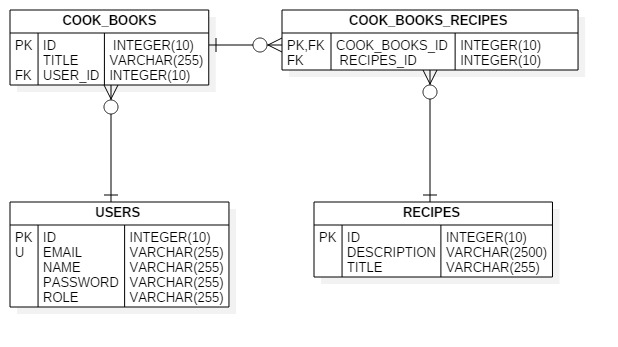
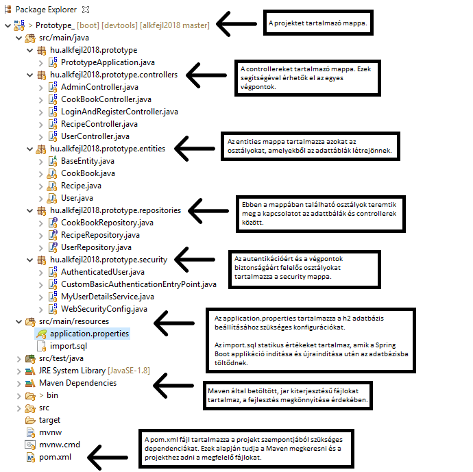
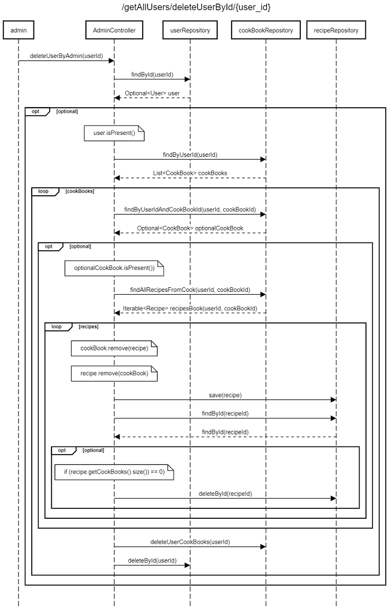

# alkfejl2018
## Projektötlet

###### FELADAT
**Egy webes alkalmazás elkészítése, amellyel a bejelentkezett felhasználók receptjeiket szakácskönyvekbe szervezhetik. Saját recepteket és szakácskönyveket hozhatnak létre, módosíthatják és törölhetik azokat. Adminisztrátorként a felhasználókat törölhetjük és lekérhetjük.**

Funkcionális követelmények

* Felhasználó: 
	* regisztráció
	* belépés
	* személyes adatok módosítása
	* regisztráció törlése

	* recept létrehozása
	* a felhasználóhoz tartozó recept törlése
	* egy szakácskönyvhöz tartozó receptek lekérése
	* recept módosítása
				
	* szakácskönyv létrehozása
	* a felhasználóhoz tartozó szakácskönyv(ek) törlése
	* szakácskönyvek lekérése
	* szakácskönyv módosítása

* Adminisztrátor: 
	* egy vagy az összes felhasználó törlése		
	* egy vagy az összes felhasználó lekérése
				
* Közös: 
	* bejelentkezés után a funkciók használata 
	* ezeket egy előre megadott listából, vagy LDAP - authentikációval kell elvégezni

Nem funkcionális követelmények

* Felhasználóbarát, ergonomikus elrendezés és kinézet. Gyors működés. Biztonságos működés: jelszavak tárolása, funkciókhoz való hozzáférés.

Szerepkörök

* felhasználó: a saját maga által létrehozott fiók, receptek és szakácskönyvek módosítása és törlése
* adminisztrátor: felhasználók, szakácskönyvek és receptek törlése, felhasználói fiókokhoz való teljes hozzáférés

## Backend megvalósítása

Fejlesztői környezet bemutatása, beállítása, használt technológiák

* Eclipse Phonton:
	* attól függően, hogy milyen nyelven szeretnénk fejleszteni, (Java, C/C++, Javascript, stb.)
	letölthető a nyelvenek megfelelő integrált fejlesztői környezetet: "Eclipse IDE for Java Developers" 
	* fejlesztői környezeten belül elérhető az "Eclipse Marketplace", ahonna további eszközök telepíthetőek
		
* Spring Boot:
	* Spring Boot használatához: "Spring Tools 3 Add-On (aka Spring Tool Suite 3) 3.9.6 RELEASE"
	* projekt indítása: jobb klikk a projektre -> "Run as" -> "Spring Boot App"
		
* Maven:
	* szoftverprojektek menedzseléséhez
	
* Postman:						
	* végpontok kipróbálásához
							
* Git/GitHub:
	* verziókövetéshez

Adatbázis-terv: táblák kapcsolati UML diagramja

Alkalmazott könyvtárstruktúra bemutatása

Végpont-tervek és leírások

AdminController:

hozzáférés: ROLE_ADMIN

kezdeti végpont: "/admin" -> autentikáció szükséges hozzá

"/getAllUsers"
	- a userRepository tartalmával tér vissza
	- miden esetben legalább egy eleme van, az admin

"/getAllUsers/getUserById/{user_id}"
	- a userRepository megadott user_id-val rendelkező elemével tér vissza

"/getAllUsers/deleteUserById/{user_id}"
	- törli a userRepository megadott user_id-val rendelkező elemét 
	- ha egy felhasználóhoz(user) tartozik szakácskönyv(cookbook), akkor az is törlődik; ha a szakácskönyvhöz recept(recipe)
	tartozik, akkor a recept is törlődik

"/deleteAllUsers"
	- az adminon kívül mindenkit töröl a userRepository-ból

---------------------------------------------------------------------------------------------------------------------------------------- 
Hozzáférés: bárki számára
Kezdeti végpont: "http://localhost:8080"
Végpont: "/register
post metódus, egy user - t vár a végpont, így a name, password, email megadása kötelező, ezeken kívül más nem kell megadni. az email -nek egyedinek kell lennie
az id és a role generálódik

----------------------------------------------------------------------------------------------------------------------------------------------------------------------------------------

UserController

hozzáférés: ROLE_USER

Kezdeti végpont: /user -> autentikáció szükséges hozzá

"/{user_id}"
	- user adatainak megváltoztatása. name, emai, password amik megadása kötelező, ha valamelyiket nem akarjuk megváltoztatni, akkor az eredetit értéket kell megadni. a role automatikusan átadódik. a password elhash -e lődik, így figyelni kell arra, hogy NE a hash -el password-ot írjuk be, különben kétszer hash e-lődik. 
	
ha nem külde be semmit: Status 400 Unauthorized

	@DeleteMapping("/{user_id}")
	public ResponseEntity<User> deleteUser(@PathVariable("user_id") Integer userId) {
	A user törli a regisztrációját. Ha a user - hez tartozott cookbook, és/vagy recipe, akkor  azok is törlére kerülnek.
		 
----------------------------------------------------------------------------------------------------------------------------------------------------------------------------------------
Hozzáférés: user
Kezdeti végpont: /user -> autentikáció szükséges hozzá
@Secured({ "ROLE_USER" })
@RequestMapping("/user/{user_id}/cookbooks")
 admin "/user" végponthoz NEM férhet hozzá
	 @GetMapping("")
	 public ResponseEntity<Iterable<CookBook>> getUserCookBooks(@PathVariable("user_id") Integer userId) {
	 egy user - het tartozó összes szakácskönyv lekérése.  Ha egy nincs szakácskönyv, üresen tér vissza.

	 @PostMapping("")
	 public ResponseEntity<CookBook> newCookBook(@PathVariable("user_id") Integer userId, @RequestBody CookBook cookBook) {
		  új szakácskönyv létrehozásához a title megadása szükséges. 
		
	@PutMapping("/{cook_book_id}")
	public ResponseEntity<CookBook> renameCookBook(@PathVariable("user_id") Integer userId, @PathVariable("cook_book_id") Integer cookBookId, 
			a szakácskönyv nevének megváltoztatásához a title megadása szükséges. 

	@DeleteMapping("/{cook_book_id}")
	public ResponseEntity<CookBook> deleteCookBook(@PathVariable("user_id") Integer userId, @PathVariable("cook_book_id") Integer cookBookId) {
	megadott id -val rendelkező szakácskönyv törlése. Ha a szakácskönyvhöz tartozik recept és a recept nem tartozik másik szakácskönyvhöz, akkor véglegesen törlére kerül.

	@DeleteMapping("")
	public ResponseEntity<CookBook> deleteCookBooks(@PathVariable("user_id") Integer userId) {
	a felhasnálóhoz tartozó összes szakácskönyv, és a szakácskönyvekhez tartozó össze recept törlére kerül. 

----------------------------------------------------------------------------------------------------------------------------------------------------------------------------------------
Hozzáférés: user
Kezdeti végpont: "/user/{user_id}/cookbooks/{cook_book_id}/recipes" -> autentikáció szükséges hozzá	

	@GetMapping("")
	public ResponseEntity<Iterable<Recipe>> getUserRecipesFromACookBook(@PathVariable("user_id") Integer userId,
			adott id -val rendelkező felhasnáló adott id - val rendelkező szakácskönyvének össze receptjé adja vissza, ha létezik. 
			Ha nem "Status: 404 Not Found", ha üres, akkor üresen tér vissza
	 
	@PostMapping("")
	public ResponseEntity<Recipe> newRecipe(@PathVariable("user_id") Integer userId, 
			@PathVariable("cook_book_id") Integer cookBookId, @RequestBody Recipe recipe)
	új recept hozzáadása adott szakácskönyvhöz. title és description megadása kötelező. 

	@DeleteMapping("")
	public ResponseEntity<Recipe> deleteRecipes(@PathVariable("user_id") Integer userId, @PathVariable("cook_book_id") int cookBookId) {
	az adott felhasnáló tartozó össze szakácskönyv és a hozzájuk tartozó receptek törlése
	
	@DeleteMapping("/{recipe_id}")
	public ResponseEntity<Recipe> deleteRecipe(@PathVariable("user_id") Integer userId, @PathVariable("cook_book_id") Integer cookBookId, 
			@PathVariable("recipe_id") Integer recipeId) {
	adott felhasnálóhoz tartozó adott szakácskönyv adott receptjét törli, ha létezik. 
	 
	@PutMapping("/{recipe_id}")
	public ResponseEntity<Recipe> modifyRecipe(@PathVariable("user_id") Integer userId, @PathVariable("recipe_id") Integer recipeId, 
	módosítja egy recept címét és/vagy tartalmát. title és description megadása kötelező. amelyiet nem akarjuk módosítani, annak az eredeti értékkel kell megegezni.
	
	@PostMapping("/{recipe_id}/addToAnotherCookBook/{other_cook_book_id}")
	public ResponseEntity<Recipe> addToAnotherCookBook(@PathVariable("user_id") Integer userId, @PathVariable("recipe_id") Integer recipeId, 
			@PathVariable("other_cook_book_id") Integer otherCookBookId) {
			
	az adott receptet hozzávehetjük egy másik szakácskönyvhöz. több szaácskönyvbe, lévő recept csak akkor tölődik véglegesen, ha az utolós olyan szakácskönyvet töröljük,
	amelyik még tartalmazza
	
1 db végpont működésének leírása, mi történik, milyen lépések követik egymást (szekvenciadiagram)

/admin/getAllUser/deleteUseById/{user_id}

public ResponseEntity<Void> deleteUserByAdmin(@PathVariable("user_id") Integer userId)

- kérés érkezik a userRepository-hoz, hogy a user_id alapján adja vissza a megfelelő felhasználót(user)
	- ha a felhasználó létezik, akkor kérés érkezik a cookBookRepository-hoz, hogy adja vissza a felhasználó
	szakácskönyveit(cookbook)
	- ezek egy listába kerülnek, amin végigiterálva törüljük a user_id és a cookbook_id alapján a felhasználóhoz tartozó
	szakácskönyvek tartalmát. Ez a következőképpen történik:
		- kérés érkezik cookBookRepository-hoz, hogy user_id-ja és a cookbook_id alapján adja vissza a szakácskönyv
		tartalmát, azaz a recepteket(recipe)
		- ha van legalább egy, az bekerül egy iterálható tárolóba
		- végigiterálunk a tároló, menet közben lekérjük a recepteket
			- a receptet először eltávolítjuk a szakácskönyvből
			- a receptetből eltávolítjuk a szakácskönyvet
			- a recept mentésre kerül recipeRepository-ba
		- ezután lekérjük ezt a receptet recipe_id alapján a recipeRepository-ból, ha nincs szakácsköny, ami hivatkozna
		rá, akkor recipe_id alapján töröljük recipeRepository-ból
- ezt addig ismételjük, amíg a felhasználó szakácskönyveiből el nem távolítjuk az összes receptet
- töröljük az üres szakácsönyveket
- töröljük a felhasználót 
	

